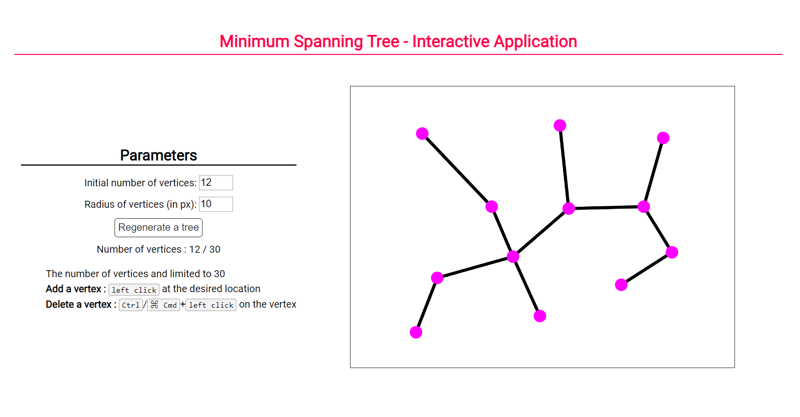

[](https://p5js.org)
[](https://www.python.org/)

[](https://github.com/armandwayoff/Minimum-Spanning-Tree)

This project was inspired by the video [9.9: Minimum Spanning Tree (Prim's Algorithm) - p5.js Tutorial](https://youtu.be/BxabnKrOjT0) made by [Daniel Shiffman](https://github.com/shiffman).

# Table of Contents

 * [Interactive Application](#interactive-application)
 * [Python Version](#python-version)
    * [How to Use This Code](#how-to-use-this-code)


# Interactive Application
The interactive application is programmed with the [p5.js library](https://p5js.org/). This library is ideal because it has a full set of drawing functionality.

To use the library, simply add it to your ```HTML``` code:
```html
<!DOCTYPE html>
<html>
  <head>
    <script src="https://cdnjs.cloudflare.com/ajax/libs/p5.js/0.10.2/p5.js"></script>
    <script src="https://cdnjs.cloudflare.com/ajax/libs/p5.js/0.10.2/addons/p5.sound.min.js"></script>
  </head>
</html>
```

[Visit the Application](https://editor.p5js.org/armandwayoff/present/MXfWDcmXq)

## Overview of the Application




# Python Version

## How to Use This Code

To run this code, you will need the libraries [NetworkX](https://networkx.github.io/) and [Matplotlib](https://matplotlib.org/). NetworkX is a Python package for the creation, manipulation, and study of the structure, dynamics, and functions of complex networks.

### Installing Matplotlib

You will find all the information necessary for its installation on the following page : <https://matplotlib.org/users/installing.html>

### Installing NetworkX

You will find all the information necessary for its installation on the following page : <https://networkx.github.io/documentation/networkx-1.9/install.html>
